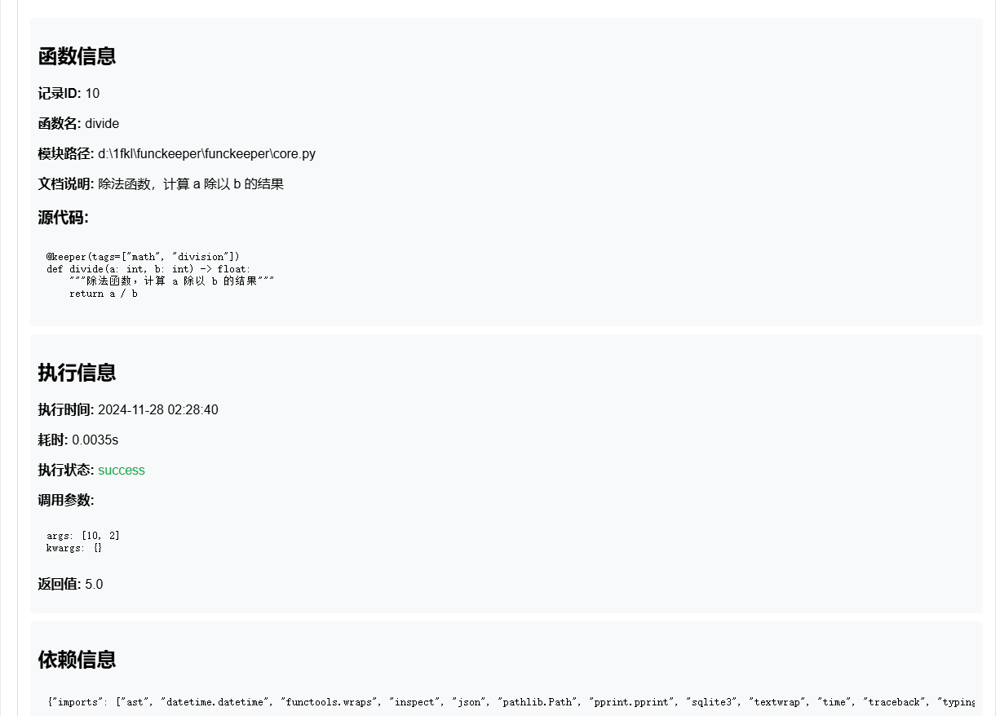
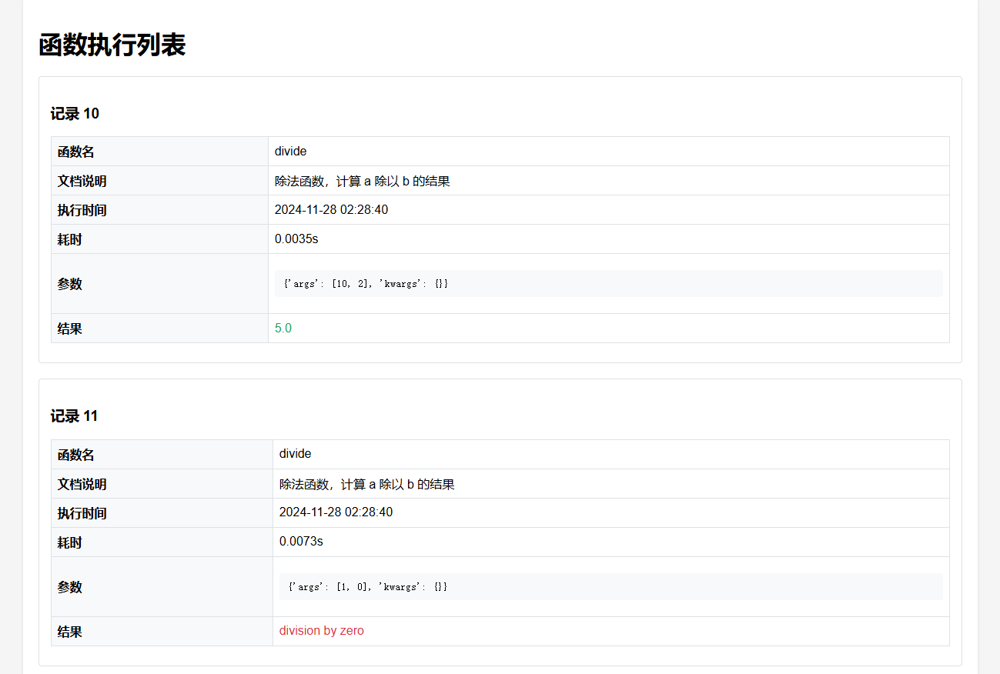
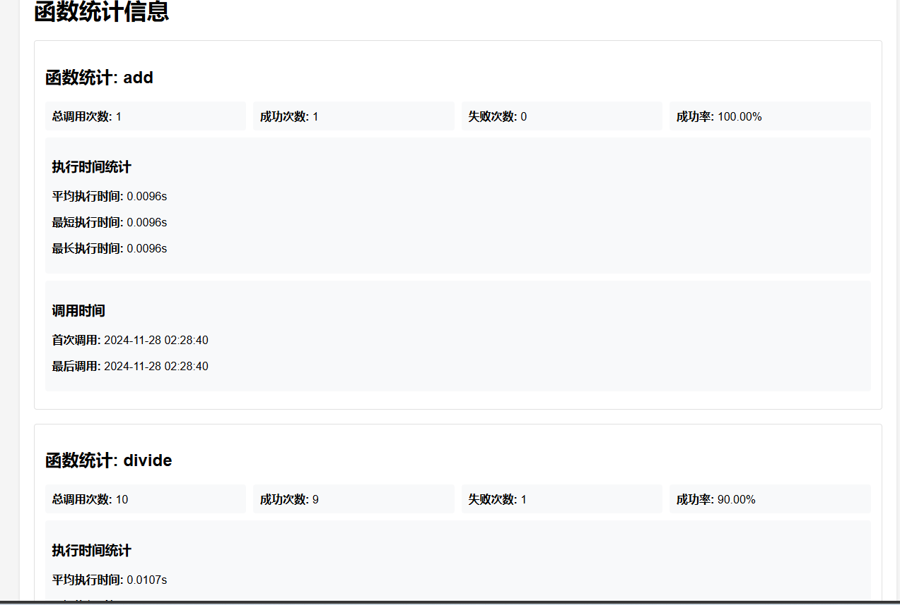

# Funckeeper
- 🚧 警告：这是一个自用开源的项目！
- 📝 记录函数的执行过程和结果
- 🔍 追踪函数执行的详细信息（参数、返回值、执行时间等）
- 📊 统计分析函数的执行情况
- 🐛 捕获和分析函数执行中的错误
- 📤 支持导出分析报告（HTML格式）

## 目的

`funckeeper` 是一个专注于 Python 函数执行记录和追踪的工具，主要用于解决以下场景：

1. **源码追溯**：当脚本文件被删除或修改后，可以通过 funckeeper 查看历史执行记录中保存的源代码，帮助恢复或重建脚本。

2. **功能回溯**：通过记录的函数文档说明、执行参数和结果，帮助开发者快速回忆和理解之前编写的脚本功能。

3. **执行分析**：
   - 记录函数的执行时间、参数、返回值等详细信息
   - 统计函数的调用次数、成功率、平均执行时间等
   - 分析函数执行过程中的错误类型和频率

4. **报告生成**：支持将执行记录、统计信息导出为HTML格式的报告，便于分享和归档。

所有执行信息都会被存储在 SQLite 数据库中，方便后续查询和分析。通过这些数据，开发者可以：
- 追溯历史执行的脚本内容和功能
- 分析函数执行效率和稳定性
- 快速定位和解决常见错误
- 生成详细的执行报告
- 重现函数执行环境
- 追踪历史脚本的依赖需求
- 确保代码迁移时的依赖完整性

## 使用手册

### 安装

确保你已经安装了 Python 3.6 及以上版本。你可以通过以下命令安装 `funckeeper`：

```bash
pip install funckeeper
```

### 基本用法

1. **初始化 `FuncKeeper` 实例**

   ```python
   from funckeeper import FuncKeeper

   keeper = FuncKeeper()
   ```

2. **装饰函数**

   使用 `FuncKeeper` 实例作为装饰器来装饰你想要记录的函数：

   ```python
   @keeper(tags=["example", "demo"])
   def my_function(x, y):
       """这是一个简单的加法函数"""
       return x + y
   ```

3. **执行函数**

   调用被装饰的函数，`funckeeper` 会自动记录执行信息：

   ```python
   result = my_function(3, 4)
   ```

4. **导出数据**

   你可以导出函数的执行详情、统计信息或执行列表：

   ```python
   keeper.export_data(data, export_type='detail', output_dir='exports')
   ```

## 示例

### 示例 1: 记录函数执行

```python
@keeper(tags=["math", "addition"])
def add(a, b):
    """返回两个数的和"""
    return a + b

add(5, 7)
```

**执行结果:**

- 函数名: `add`
- 执行时间: `2024-11-27 18:13:47`
- 耗时: `0.0001s`
- 返回值: `12`
- 标签: `math, addition`

### 示例 2: 导出执行详情

```python
data = keeper.get_record_detail(1)
keeper.export_data(data, export_type='detail', output_dir='exports')
```

**生成的HTML文件:**

- 文件名: `funckeeper_detail_20241127_181347.html`
- 包含函数的执行详情，包括参数、返回值、执行时间等。

### 高级用法示例

### 示例 3: 获取函数统计信息

```python
from funckeeper import FuncKeeper
from datetime import datetime

keeper = FuncKeeper('test.db')

# 获取所有函数的统计信息
stats = keeper.get_statistics()

# 获取特定时间范围内的统计信息
start_date = datetime(2024, 1, 1)
end_date = datetime(2024, 12, 31)
stats = keeper.get_statistics(
    func_name="my_func",
    start_date=start_date,
    end_date=end_date,
    status="success"
)

# 打印统计信息
keeper.print_statistics(stats)
```

**执行结果:**
```
=== 函数统计: my_func ===
总调用次数: 9
成功次数: 9
失败次数: 0
成功率: 100.00%
平均执行时间: 0.0111s
最短执行时间: 0.0035s
最长执行时间: 0.0241s
首次调用: 2024-11-28 02:18:26
最后调用: 2024-11-28 02:28:40
```

### 示例 4: 搜索执行记录

```python
# 按关键字和标签搜索
results = keeper.search(
    keyword="calculate",
    tags=["math", "important"],
    status="error",
    start_date=datetime(2024, 1, 1),
    end_date=datetime(2024, 12, 31)
)
```

**执行结果:**
```
找到 1 条记录:

--- 记录 1 ---
记录ID: 11
函数名: divide
文档说明: 除法函数，计算 a 除以 b 的结果
执行时间: 2024-11-28 02:28:40
耗时: 0.0073s
调用参数: 1, 0
错误信息: division by zero
```

## 主要函数参数说明

### FuncKeeper 类

#### `get_statistics(func_name: str = None, start_date: datetime = None, end_date: datetime = None, status: str = None)`
- `func_name`: 要统计的函数名称（可选）
- `start_date`: 统计开始时间（可选）
- `end_date`: 统计结束时间（可选）
- `status`: 执行状态筛选，可选值："success"或"error"

#### `search(keyword: str = None, tags: List[str] = None, status: str = None, start_date: datetime = None, end_date: datetime = None)`
- `keyword`: 搜索关键字，会匹配函数名、源代码、文档和错误信息
- `tags`: 标签列表，用于筛选特定标签的记录
- `status`: 执行状态筛选
- `start_date`: 搜索开始时间
- `end_date`: 搜索结束时间

#### `export_data(data: Any, export_type: str, output_dir: str = "exports")`
- `data`: 要导出的数据
- `export_type`: 导出类型，可选值：
  - "detail": 导出详细执行记录
  - "statistics": 导出统计信息
  - "list": 导出执行记录列表
- `output_dir`: 导出文件保存目录，默认为"exports"

### 示例 5: 完整的错误处理示例

```python
from funckeeper import FuncKeeper

keeper = FuncKeeper()

@keeper(tags=["math", "division"])
def divide(a, b):
    """安全除法函数"""
    try:
        return a / b
    except ZeroDivisionError as e:
        raise ValueError("除数不能为零") from e

# 测试正常情况
result = divide(10, 2)  # 返回 5.0

# 测试错误情况
try:
    result = divide(10, 0)
except ValueError as e:
    print(f"捕获到错误: {e}")

# 获取函数统计信息
stats = keeper.get_statistics(func_name="divide")
keeper.print_statistics(stats)
```

**执行结果:**
```
捕获到错误: 除数不能为零

=== 函数统计: divide ===
总调用次数: 12
成功次数: 10
失败次数: 2
成功率: 83.33%
平均执行时间: 0.0106s
最短执行时间: 0.0035s
最长执行时间: 0.0241s
首次调用: 2024-11-28 02:18:26
最后调用: 2024-11-28 03:27:28

错误类型分布:
- ValueError: 1次
- ZeroDivisionError: 1次
```
### 示例 6: 导出搜索结果

```python
    keeper = FuncKeeper(r"D:\1fkl\test.db")

    # 获取所有函数的统计信息
    @keeper(tags=["math", "division"])
    def divide(a, b):
        """安全除法函数"""
        try:
            return a / b
        except ZeroDivisionError as e:
            raise ValueError("除数不能为零") from e

    # 测试正常情况
    result = divide(10, 2)  # 返回 5.0

    # 测试错误情况
    try:
        result = divide(10, 0)
    except ValueError as e:
        print(f"捕获到错误: {e}")

    # 获取函数统计信息
    stats = keeper.get_statistics(func_name="divide")
    keeper.print_statistics(stats)
    # 导出搜索结果列表
    results = keeper.search(keyword="除法")
    if results:
        filepath = keeper.export_data(results, "list", r"D:\1fkl\exports")
        print(f"\n搜索结果已导出到: {filepath}")

    # # 导出详细信息
    if results:
        detail = keeper.get_record_detail(results[0]["id"])
        if detail:  # 确保有返回值
            filepath = keeper.export_data(detail, "detail", "exports")
            print(f"\n详细信息已导出到: {filepath}")

    # # 导出统计信息
    stats = keeper.get_statistics()
    filepath = keeper.export_data(stats, "statistics", "exports")
    print(f"\n统计信息已导出到: {filepath}")
```
```
--- 记录 1 ---
记录ID: 6
函数名: divide
文档说明: 安全除法函数
执行时间: 2024-11-28 06:03:24
耗时: 0.0084s
调用参数: 10, 0
错误信息: 除数不能为零

--- 记录 2 ---
记录ID: 5
函数名: divide
文档说明: 安全除法函数
执行时间: 2024-11-28 06:03:23
耗时: 0.0128s
调用参数: 10, 2
返回值: 5.0

--- 记录 3 ---
记录ID: 3
函数名: divide
文档说明: 安全除法函数
执行时间: 2024-11-28 06:03:04
耗时: 0.0000s
调用参数: 10, 2
返回值: 5.0

--- 记录 4 ---
记录ID: 4
函数名: divide
文档说明: 安全除法函数
执行时间: 2024-11-28 06:03:04
耗时: 0.0095s
调用参数: 10, 0
错误信息: 除数不能为零

--- 记录 5 ---
记录ID: 1
函数名: divide
文档说明: 安全除法函数
执行时间: 2024-11-28 06:02:16
耗时: 0.0114s
调用参数: 10, 2
返回值: 5.0

--- 记录 6 ---
记录ID: 2
函数名: divide
文档说明: 安全除法函数
执行时间: 2024-11-28 06:02:16
耗时: 0.0000s
调用参数: 10, 0
错误信息: 除数不能为零

搜索结果已导出到: D:\1fkl\exports\funckeeper_list_20241128_140324.html
```

### 导出html示例




这些示例展示了 `funckeeper` 的主要功能和使用场景，包括函数装饰、错误处理、统计分析和数据导出等特性。

## 许可证

`funckeeper` 遵循 MIT 许可证。详细信息请参阅 LICENSE 文件。